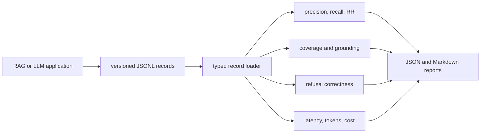

# LLM Evaluation Toolkit Case Study

## Problem and solution

LLM applications often report example answers without separating retrieval, grounding, refusal, latency, and usage behavior. This toolkit accepts provider-agnostic JSONL records and produces deterministic per-record and aggregate reports that can run in CI without paid APIs.

## Architecture



## Trade-offs

- Lexical metrics are transparent and deterministic, but they penalise valid paraphrases.
- Provider-agnostic records improve portability, while instrumentation remains the caller's responsibility.
- Zero token or cost values mean unavailable telemetry, not free execution.

## Measured validation

- `ruff check .` passes on Python 3.13.
- `pytest -q` passes all 4 tests.
- GitHub Actions run `29163758556` passes.
- The AI FAQ v1 export loads successfully and produces matching aggregate metrics.

## Limitations and failure modes

- Token overlap is not a semantic or human correctness judgment.
- Citation coverage checks identifiers, not claim-level entailment.
- Cost is accepted from the caller and is not independently verified.
- PR 2 still requires an independent approving review before merge.

## Reproduce

```bash
python -m venv .venv
source .venv/bin/activate
pip install -e '.[dev]'
ruff check .
pytest -q
llm-eval evaluate examples/sample.jsonl --output-dir reports/sample
```
